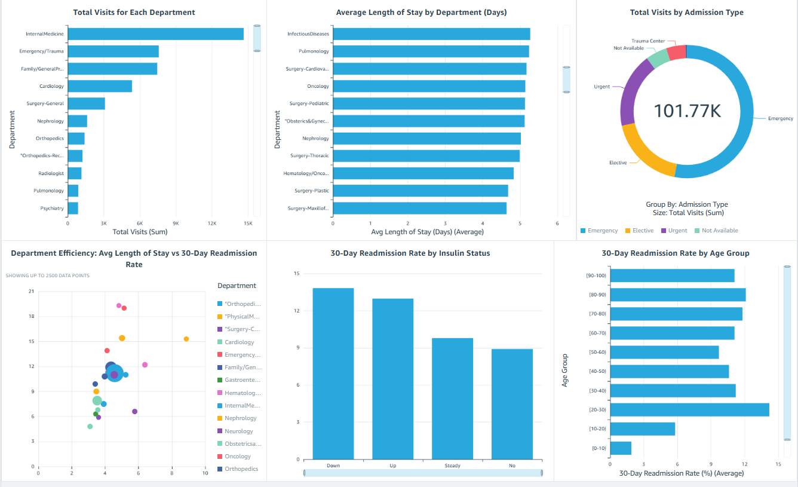

# Healthcare Operations Analytics on AWS (End-to-End ETL Pipeline)

## Project Overview

This project implements an end-to-end cloud-based ETL and analytics pipeline on AWS to analyze hospital operations data. The pipeline transforms raw healthcare encounter data into curated, business-ready KPIs and interactive visualizations to support operational decision-making.

It covers the full analytics lifecycle; from raw ingestion to dashboard consumption, using managed AWS services.

Checkout my Medium article where I do a detailed walkthrough of the project.

**Link**: https://medium.com/@singhria.0829/end-to-end-aws-healthcare-etl-project-breakdown-66582b2f197b

---

## Business Problem

Hospitals generate large volumes of operational data every day, but decision-makers often lack clear, actionable insights into department performance. The core questions this project set out to answer:

- Which departments have the highest patient readmission rates and why?
- How does average length of stay vary across departments?
- Which departments are operationally efficient vs. which ones are a drain on resources?
- Who are the highest-risk patients for 30-day readmission?
- How is patient volume distributed across admission types?

Without a structured analytics pipeline, raw data is difficult to analyse, metrics become inconsistent, and dashboards can produce misleading results.

---

## Objective

Build a scalable cloud analytics pipeline that:

- Cleans and standardizes raw hospital encounter data
- Produces curated KPI datasets aligned with business metrics
- Uncovers actionable insights through Athena SQL analysis
- Enables interactive decision-making through an Amazon QuickSight dashboard

---

## Dataset

- **Source:** UCI Machine Learning Repository
- **Dataset:** Diabetes 130-US Hospitals Dataset
- **Records:** ~100,000 hospital encounters (2026 hospitals, 1999–2008)
- **Format:** CSV
- **Link:** https://archive.ics.uci.edu/ml/datasets/diabetes+130-us+hospitals+for+years+1999-2008

The dataset includes patient encounter details: diagnoses, admission types, medical specialties, length of stay, medications, lab procedures, and readmission status.

---

## Architecture Overview

The pipeline follows a layered data lake design with clear separation between raw, cleaned, and curated data.

```text
Raw CSV Data
     |
     v
Amazon S3 (Raw Layer)
     |
     v
AWS Glue DataBrew (Data profiling and cleaning)
     |
     v
Amazon S3 (Cleaned Layer: Parquet)
     |
     v
AWS Glue PySpark Jobs (Curated KPI transformations)
     |
     v
Amazon S3 (Curated Layer: Parquet)
     |
     v
AWS Glue Crawlers (Schema discovery → Glue Data Catalog)
     |
     v
Amazon Athena (SQL analytics, validation, and insight exploration)
     |
     v
Amazon QuickSight (Interactive dashboard)
```

---

## ETL Workflow

### Step 1: Raw Data Ingestion
Raw CSV files uploaded to Amazon S3 (`s3://healthcare-ops-analytics-ria/raw/`). Stored as-is immutable source of truth, allowing full reprocessing at any time.

### Step 2: Data Profiling and Cleaning (AWS Glue DataBrew)
DataBrew was used to profile the dataset and perform column selection. The raw data was largely clean, no duplicate encounter IDs, no negative values, and sensible numeric ranges across all operational fields.

Key action: dropped 35 non-operational or high-cardinality columns including individual medication flags, `weight` (97% missing), `payer_code` (40% missing), `max_glu_serum`, `A1Cresult`, and diagnosis code fields. Retained the 15 columns relevant to operational KPIs.

Output written to S3 cleaned layer, registered in Glue Catalog under `healthcare_cleaned_db`.

**Note:** The `medical_specialty` column retained `?` placeholders (49% of records) in the cleaned output- this was intentionally resolved in the PySpark ETL layer (Step 3) by standardising to `"Unknown"` before aggregation, as it was a transformation decision tied to KPI logic rather than a structural cleaning step. The `patient_nbr` field contains expected duplicates- the same patient can have multiple encounters, which is standard in hospital datasets.

### Step 3: Curated KPI Development (AWS Glue PySpark — Job 1)
First Glue ETL job produced two operational KPIs:
- **Avg Length of Stay by Department** - grouped by `medical_specialty`, handled nulls and `?` values, computed average `time_in_hospital` and total visits
- **Patient Volume by Admission Type** - mapped numeric `admission_type_id` to readable labels (Emergency, Elective, Urgent etc.) via a dimension table join; required explicit type casting to fix a silent Spark join failure

### Step 4: Readmission KPI Development (AWS Glue PySpark — Job 2)
Second Glue ETL job joined the cleaned data back to the raw source to recover `age` and `insulin` columns (dropped during DataBrew cleaning), then produced three additional KPIs:
- **Readmission by Department** -30-day readmission rate, any readmission rate, and a composite efficiency score per department
- **Readmission by Age** -30-day readmission rate across age bands ([0-10) through [90-100))
- **Readmission Risk Profile** -age x insulin status breakdown of readmission rates

### Step 5: Schema Registration (AWS Glue Crawlers)
Separate crawlers for cleaned and curated layers automatically detect schema changes and register tables in the Glue Data Catalog; enabling Athena to query all layers without manual table definitions.

### Step 6: Analytics and Validation (Amazon Athena)
SQL queries used to validate each KPI output after every Glue job run, and to explore the data for insights before building visuals. Key queries are documented in the `athena_queries/` folder.

### Step 7: Dashboard (Amazon QuickSight)
Six visuals published in a single dashboard, organised into two layers: operational basics and readmission insights.

---

## Key Findings

### Finding 1: 1,429 Excess Readmissions Across 12 Departments
Using Cardiology (7.9% 30-day readmission rate) as the benchmark; the highest-volume efficient department- 12 departments with 500+ visits performed worse. If those departments matched Cardiology's rate, **1,429 fewer patients** would have been readmitted within 30 days.

| Department | Visits | Readmit Rate | Excess Readmissions |
|---|---|---|---|
| InternalMedicine | 14,635 | 11.2% | 483 |
| Family/GeneralPractice | 7,440 | 11.9% | 298 |
| Emergency/Trauma | 7,565 | 11.2% | 250 |
| Nephrology | 1,613 | 15.4% | 121 |
| Surgery-General | 3,099 | 11.0% | 96 |

### Finding 2 — Nephrology is the Most Inefficient High-Volume Department
Nephrology handles 1,613 patients with a 15.4% 30-day readmission rate and 5.02-day average stay- nearly double the readmission rate of top-performing departments and the longest average stay among high-volume specialties. Efficiency score: **46.8 / 100** -lowest of all departments with 500+ visits.

### Finding 3 — Department Efficiency Score (0–100)
A composite efficiency score was built by combining normalised avg LOS and 30-day readmission rate (weighted 50/50):

| Department | Visits | Avg LOS | Readmit Rate | Efficiency Score |
|---|---|---|---|---|
| ObstetricsandGynecology | 671 | 3.1 days | 4.8% | 100.0 |
| Cardiology | 5,352 | 3.53 days | 7.9% | 85.6 |
| InternalMedicine | 14,635 | 4.58 days | 11.2% | 65.1 |
| Family/GeneralPractice | 7,440 | 4.36 days | 11.9% | 64.6 |
| Nephrology | 1,613 | 5.02 days | 15.4% | 46.8 |

### Finding 4 — Counterintuitive Age Pattern
Expected: elderly patients have the highest readmission rates. Actual finding: **patients aged 20–30 had the highest 30-day readmission rate at 14.2%** -higher than every other age group including 80–90 year olds (12.1%). This likely reflects medication compliance and chronic disease management challenges in younger diabetic patients.

| Age Group | Total Patients | 30-Day Readmission Rate |
|---|---|---|
| [20-30) | 1,657 | **14.2%** |
| [80-90) | 17,197 | 12.1% |
| [70-80) | 26,068 | 11.8% |
| [50-60) | 17,256 | 9.7% |

### Finding 5 — Insulin Adjustment is a Readmission Risk Signal
Patients whose insulin dosage was changed during their hospital visit (Up or Down) had meaningfully higher 30-day readmission rates than patients on no insulin:
- Insulin Down: 13.9% readmission rate
- Insulin Up: 13.0% readmission rate
- No insulin: 10.0% readmission rate

### Finding 6 — Highest Risk Patient Combination
The riskiest patient group: **[20-30) age band with insulin increased (Up)** -21.0% 30-day readmission rate. 1 in 5 of these patients returned within 30 days. This points to a specific, actionable follow-up opportunity post-discharge.

---

## Dashboard

Six visuals published in Amazon QuickSight:

**Operational Layer:**
- Total Visits for Each Department (bar chart)
- Average Length of Stay by Department (bar chart)
- Total Visits by Admission Type (donut chart)

**Readmission Insights Layer:**
- Department Efficiency: Avg LOS vs 30-Day Readmission Rate (scatter plot -bubble size = patient volume)
- 30-Day Readmission Rate by Age Group (horizontal bar chart)
- 30-Day Readmission Rate by Insulin Status (bar chart)

Dashboard screenshots available in the `dashboard/` folder.



---

## Challenges Encountered

### Data Quality Issues
`medical_specialty` contained `?` placeholders and nulls requiring standardisation to `Unknown`. `admission_type_id` was stored as numeric codes needing a dimension mapping table. Both required multiple PySpark iterations to resolve cleanly.

### IAM Permission Errors
Glue job failed with `AccessDenied: s3:PutObject` when writing curated outputs. Fixed by explicitly scoping `s3:PutObject`, `s3:GetObject`, and `s3:ListBucket` permissions on the project bucket in the Glue service role policy.

### Silent Spark Join Failure
The `admission_type_id` join returned empty results with no error — caused by a `StringType` vs `IntegerType` mismatch between the fact table and dimension mapping table. Fixed by explicitly casting both sides before joining. Detected only through Athena validation, not from job logs.

### Missing Columns After Cleaning
`age` and `insulin` columns were dropped during DataBrew cleaning as non-operational. Required joining cleaned data back to the raw S3 source on `encounter_id` in Job 2 to recover them for the readmission analysis.

### QuickSight Aggregation Issues
Pre-aggregated metrics (like `avg_los_days`) were being re-aggregated by QuickSight using SUM instead of AVG, inflating values. Fixed by explicitly setting measure-level aggregations per visual field.

---

## Future Improvements

- Orchestrate Glue jobs and crawlers with AWS Step Functions (auto-trigger crawler after ETL job success)
- Parameterise Glue jobs to eliminate code edits when thresholds or mappings change
- Add automated data quality checks using AWS Deequ (null rate thresholds, join result validation)
- Enable event-driven reprocessing: S3 upload triggers Lambda → Step Functions
- Version curated outputs with timestamp-based S3 folders for full audit trail and rollback capability

---

## Tools and Technologies

| Layer | Service |
|---|---|
| Storage | Amazon S3 |
| Profiling & Cleaning | AWS Glue DataBrew |
| Transformation | AWS Glue PySpark (ETL Jobs) |
| Schema Management | AWS Glue Crawlers + Data Catalog |
| Analytics & Validation | Amazon Athena |
| Visualisation | Amazon QuickSight |

---

## Repository Structure

```text
Healthcare-Operations-Analytics-on-AWS/
├── README.md
├── architecture/
│   └── architecture.webp
├── pyspark/
│   ├── kpi_job1_avg_los_admission_type.py
│   └── kpi_job2_readmission_kpis.py
├── athena_queries/
│   └── exploration_queries.sql
├── dashboard/
│   └── healthcare_operations_dashboard.png
├── databrew_cleaning/
│   └── data_cleaning.png
└── storage/
    └── s3_layers.png
```

---

## Notes


- The dataset is publicly available and not included directly in this repository.
- All S3 bucket names reference the project account and are not publicly accessible.
- **On the PySpark scripts:** The analytical logic, business questions, KPI definitions, and transformation decisions in both Glue jobs are entirely my own. The PySpark syntax was written with AI assistance. I understand every block of the code and can explain the logic, but PySpark is not a language I write independently from scratch. The core skills demonstrated here are data analysis, pipeline design, and AWS service integration.
